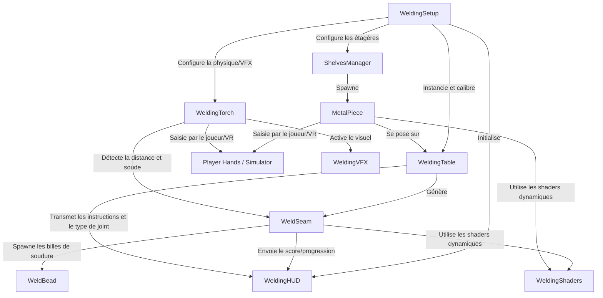

# Welding 101 - VR Welding Workshop 🥽⚡🔩

Bienvenue dans **Welding 101**, un simulateur d'atelier de soudage immersif en Réalité Virtuelle (VR). Développé par **Overheat Studios**, ce projet permet aux utilisateurs d'apprendre et de s'entraîner aux techniques de soudage professionnelles dans un environnement virtuel sécurisé, interactif et hautement réaliste. 

Le simulateur prend en charge le matériel de réalité virtuelle (casques Meta Quest) ainsi qu'un mode de simulation clavier/souris complet pour le développement et les tests.

---

## 🛠️ Technologies Utilisées (`Technologies`)

Le projet repose sur un empilement technologique de pointe adapté pour la VR autonome et le rendu en temps réel :

*   **Moteur de Jeu :** [Unity 6](https://unity.com/) (Version exacte : `6000.3.15f1`).
*   **Pipeline de Rendu :** Pipeline de Rendu Universel (**URP - Universal Render Pipeline** v17.3.0) assurant des performances optimales sur mobile VR tout en offrant des effets de lumière avancés (bloom, émission). Les shaders possèdent un système adaptatif automatique pour repasser sur le **Pipeline Built-in (Standard)** si aucun asset URP n'est actif.
*   **Intégration VR & Matériel :**
    *   **Meta XR SDK** (v72.0.0 core & interaction.ovr) : Gestion fine de l'interaction physique, du grab et des contrôleurs de mouvement Quest.
    *   **Meta XR Simulator** (v81.0.0) : Permet de simuler les actions VR et de tester les scènes directement dans l'éditeur sans casque.
    *   **OpenXR & XR Management** : Standardisation de la couche VR pour assurer la compatibilité multi-plateforme.
*   **Multijoueur / Réseau (Prêt pour l'intégration) :**
    *   **Unity Netcode for GameObjects** (v2.11.1) : Base pour la synchronisation réseau des objets physiques et du soudage.
    *   **Unity Lobby** (v1.3.0) & **Relay** (v1.2.0) : Services cloud pour l'organisation de sessions et la traversée de pare-feu en multijoueur.
*   **IA & Déplacements :** **Unity AI Navigation** (v2.0.12) pour la gestion du pathfinding et les déplacements dans l'atelier.

---

## 🚀 Fonctionnalités Clés (`Fonctionnalités`)

### 📦 1. Bibliothèque de Pièces Métalliques Procédurales
Le projet propose 6 types de pièces métalliques, modélisées dynamiquement à partir de primitives 3D au démarrage du jeu :
*   **Flat Plate** (Plaque plane - Acier gris)
*   **L-Bracket** (Cornière en L - Cuivre/Laiton)
*   **Pipe Section** (Section de tube - Acier foncé)
*   **T-Bracket** (Support en T - Acier clair)
*   **Thick Slab** (Dalle épaisse - Fonte lourde)
*   **Angle Iron** (Fer d'angle - Fer)

Ces pièces sont disposées sur 4 étagères de stockage (**BoardShelf A, B, C, D**). Dès qu'un joueur saisit une pièce, une nouvelle réapparaît automatiquement après un délai de 3 secondes, assurant un approvisionnement infini.

### 📐 2. Workbench & Snapping Intelligent
*   **Calibration Dynamique :** Au démarrage, le système effectue une série de lancers de rayons (Raycasts) sur le modèle 3D de l'établi (`workbench`) pour déterminer sa hauteur exacte et ses dimensions, garantissant que les objets s'y posent parfaitement sans risque de traverser ou de flotter.
*   **Saisie & Pose :** Les pièces métalliques peuvent être saisies, déplacées, jetées ou posées sur l'établi. Lorsqu'une pièce s'approche de la table, elle s'illumine en vert pour indiquer qu'elle peut être aimantée (snappée) à la surface.

### 🔍 3. Détection de Joint & Génération de Jointure
Lorsque deux pièces sont placées sur la zone de soudage de l'établi, le système analyse mathématiquement leurs positions relatives et leurs orientations pour identifier automatiquement le type de soudure requis :
1.  **Lap Joint** (Soudure à clin / recouvrement) : Pièces superposées.
2.  **T-Joint / Fillet** (Soudure en T / angle) : Une pièce posée à plat, l'autre à la verticale.
3.  **Butt Joint / V-Groove Joint** (Soudure bout à bout / en V) : Pièces placées côte à côte (détecte l'épaisseur pour le V-Groove).

Une fois le joint détecté, une ligne de **points guides orange** (Weld Seam) apparaît précisément à l'intersection des deux pièces.

### ⚡ 4. Chalumeau de Soudage Interactif (Welding Torch)
La torche de soudage propose un comportement physique interactif en deux phases :
*   **Phase 1 (Arc & Effets) :** Dès que la gâchette est enfoncée alors que la torche est tenue, les effets visuels (jaillissement d'étincelles avec système de particules directionnel + lumière bleue vacillante simulant l'arc électrique) et un bruitage de grésillement s'activent immédiatement.
*   **Phase 2 (Soudure) :** Si l'extrémité de la torche (`TorchTip`) est amenée à moins de 6 cm de la ligne guide orange, la matière fusionne et dépose des cordons de soudure dorés.

### 🔊 5. Synthèse Audio Procédurale
Pour éviter les fichiers audio lourds et répétitifs, le projet génère **de manière procédurale** son propre son de grésillement électrique en temps réel via du code C# combinant des ondes sinusoïdales à différentes fréquences (60Hz, 120Hz, 240Hz) avec du bruit blanc.

### 🌡️ 6. Simulation Thermique de la Matière (Cooling Effect)
Les cordons de soudure déposés subissent une simulation de refroidissement de 15 secondes gérée par shader :
1.  **Métal Liquide (0s - 1.5s) :** Blanc/jaune très lumineux (forte émission).
2.  **Matière Chaude (1.5s - 6s) :** Orange vif.
3.  **Refroidissement Moyen (6s - 12s) :** Rouge cerise puis rouge terne.
4.  **Refroidi (12s - 15s) :** Noir mat (couleur de scorie froide, émission éteinte).

### 📐 7. Assemblage Structurel Physique (Welding Assembly)
Une fois la ligne guide entièrement soudée (couverture à 100%), les deux pièces fusionnent physiquement :
*   La pièce fille est rattachée (parentée) à la pièce mère.
*   Leurs scripts de physique (`Rigidbody` et interactions de grab) individuels sont nettoyés pour que l'assemblage final se comporte comme un **seul et unique solide physique rigide** pouvant être saisi et manipulé ensemble.

### 📊 8. Système d'Évaluation & Scoring
Le simulateur évalue en temps réel le travail de l'étudiant. À la fin de la tâche, une note globale est calculée selon deux critères :
1.  **Précision d'alignement (60% de la note) :** Écart moyen entre la torche et la ligne de jointure idéale.
2.  **Régularité de vitesse (40% de la note) :** Écart par rapport à la vitesse de déplacement recommandée de **0.04 m/s**.
*   **Grades obtenus :** **S** (Excellent), **A**, **B**, **C**, **D**, ou **F** (Échec).

Un écran virtuel interactif (HUD) flottant au-dessus de la table affiche ces étapes, le taux de couverture en temps réel, et la note finale. Un bouton physique rouge **Clear Table** permet de réinitialiser l'atelier.

---

## 🏗️ Architecture Logicielle (`Architecture`)

L'architecture est modulaire et découplée, structurée autour d'un gestionnaire d'amorçage et de scripts de composants spécialisés :

### Diagramme de Relations des Composants

### Rôles des Scripts Principaux

*   **`WeldingSetup.cs` (Bootstrapper) :** Initialise l'environnement au lancement du niveau. Mesure l'établi, instancie la zone de la table, configure le chalumeau (VFX, physique du tip), lance le gestionnaire d'étagères, le HUD et crée le bouton de réinitialisation.
*   **`WeldingTable.cs` (Manager de Zone) :** Gère la logique de la zone de travail. Reçoit les pièces posées, calcule leur géométrie relative pour identifier le type de joint et générer la ligne de soudure. Déclenche la fusion solide des objets lorsque la tâche est accomplie.
*   **`MetalPiece.cs` (Objet Saisissable) :** Attaché à chaque bloc métallique. Gère le ramassage VR/clavier, la détection de proximité de l'établi, l'illumination visuelle, l'alignement sur la table et la libération de sa contrainte physique lors du snapping.
*   **`WeldSeam.cs` (Ligne de Soudure) :** Trace le chemin à souder au moyen de sphères guides orange. Détecte la proximité du chalumeau, enregistre l'avancement segment par segment, instancie les cordons de soudure physiques et calcule la note finale de l'utilisateur.
*   **`WeldBead.cs` (Bille de Soudure thermochromique) :** Gère l'animation de refroidissement thermique du cordon de soudure en faisant varier la couleur d'émission du shader standard ou URP sur une durée paramétrable.
*   **`WeldingTorch.cs` (Contrôleur de l'Outil) :** Lit les entrées de l'utilisateur (gâchettes VR / souris / clavier). Gère la transition entre l'état inactif, l'état de tir à blanc (VFX/SFX seuls) et l'état de dépôt actif (quand l'outil touche le joint).
*   **`WeldingVFX.cs` (Effets Visuels) :** Configure le système de particules d'étincelles (cone étroit, dégradé de couleur chaud, réduction de taille) et gère le vacillement aléatoire de l'arc de lumière bleue via un bruit de Perlin.
*   **`ShelvesManager.cs` (Gestionnaire d'Approvisionnement) :** Détecte les étagères de l'atelier, y aligne les pièces constitutives et gère leur cycle de réapparition à l'aide de coroutines de temporisation.
*   **`WeldingHUD.cs` (Interface Utilisateur) :** Gère un panneau d'affichage virtuel en orientation *billboard* (faisant toujours face à la caméra active du joueur). Affiche les consignes textuelles d'étape et le score final.
*   **`WeldingShaders.cs` (Générateur de Matériaux) :** Fournit des méthodes pour créer dynamiquement des matériaux (opaques, transparents, émissifs) compatibles avec URP ou le moteur de rendu classique en interrogeant la configuration active d'Unity.
*   **`JointButton.cs` :** Permet la création de boutons tridimensionnels cliquables au pointeur laser, au clic souris ou par collision physique directe avec la torche ou la main du joueur.

---

## 🎮 Commandes & Raccourcis de Test (`Getting Started`)

Pour faciliter le développement et l'évaluation rapide dans l'éditeur Unity sans casque VR branché, des **raccourcis clavier/souris** ont été intégrés dans les scripts :

| Action | Contrôles VR (Quest Controllers) | Mode Clavier / Souris (Fallback Simulateur) |
| :--- | :--- | :--- |
| **Saisir un objet** (Pièce / Torche) | Gâchette de grip latérale (main gauche ou droite) | Viser l'objet + **Touche `E`** |
| **Relâcher un objet** | Relâcher la gâchette de grip | **Touche `E`** (si l'objet est tenu) |
| **Déclencher le chalumeau** | Gâchette d'index (gauche ou droite) | Maintenir **Clic Gauche Souris** ou **Espace** |
| **Pousser un bouton** (ex: Clear) | Toucher physiquement le bouton avec la main / torche | **Clic Gauche Souris** sur le bouton |
